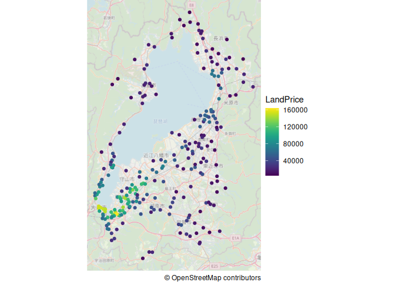

都道府県地価調査(ポイントデータの地図表示)
================

# Setup: Library読み込み

# 都道府県地価調査データを取得する

「国土数値情報ダウンロードサービス」 by
国土交通省を使って，「国土数値情報
都道府県地価調査(ポイント)」を取得する

<https://nlftp.mlit.go.jp/ksj/gml/datalist/KsjTmplt-L02-v2_3.html>

ここでは、滋賀県のデータ(2023年、世界測地系)
L02-23_25_GML.zipをダウンロードし、ファイルを解凍する。

# 都道府県地価調査データ(geojson file)を読み込む

解凍したファイルのうち、GeoJsonフォーマットのデータを読み込む

``` r
data = st_read("L02-23_25.geojson")
```

    ## Reading layer `L02-23_25' from data source 
    ##   `/home/aoki/Dropbox/00CurrentProject/2023-人文社会学モデルシラバス/DSPracticeExampleForHumanities/LandPrices-PointsOnMap/L02-23_25.geojson' 
    ##   using driver `GeoJSON'
    ## Simple feature collection with 384 features and 135 fields
    ## Geometry type: POINT
    ## Dimension:     XY
    ## Bounding box:  xmin: 135.856 ymin: 34.85849 xmax: 136.4057 ymax: 35.55822
    ## Geodetic CRS:  WGS 84

``` r
head(data)
```

    ## Simple feature collection with 6 features and 135 fields
    ## Geometry type: POINT
    ## Dimension:     XY
    ## Bounding box:  xmin: 135.8686 ymin: 35.04711 xmax: 135.9202 ymax: 35.13743
    ## Geodetic CRS:  WGS 84
    ##   L02_001 L02_002 L02_003 L02_004 L02_005 L02_006 L02_007 L02_008 L02_009
    ## 1     000     001     000     001    2023   54700    -2.3       1   false
    ## 2     000     002     000     002    2023   98500     0.0       1   false
    ## 3     000     003     000     003    2023   90500     2.5       1   false
    ## 4     000     004     000     004    2023   71700     1.0       1   false
    ## 5     000     005     000     005    2023   49000    -3.9       1   false
    ## 6     000     006     000     006    2023   76500     0.8       1   false
    ##   L02_010 L02_011 L02_012 L02_013 L02_014 L02_015 L02_016 L02_017 L02_018
    ## 1   false   false   false   false   false   false   false   false   false
    ## 2   false   false   false   false   false   false   false   false   false
    ## 3   false   false   false   false   false   false   false   false   false
    ## 4   false   false   false   false   false   false   false   false   false
    ## 5   false   false   false   false   false   false   false   false   false
    ## 6   false   false   false   false   false   false   false   false   false
    ##   L02_019 L02_020 L02_021                                      L02_022
    ## 1   false   25201    大津               滋賀県　大津市向陽町１６番１６
    ## 2   false   25201    大津         滋賀県　大津市唐崎１丁目４７６番１０
    ## 3   false   25201    大津         滋賀県　大津市今堅田２丁目２２番３８
    ## 4   false   25201    大津 滋賀県　大津市本堅田３丁目字徳行１８７１番８
    ## 5   false   25201    大津         滋賀県　大津市日吉台４丁目２０番１２
    ## 6   false   25201    大津 滋賀県　大津市坂本７丁目字九条２５２７番２８
    ##                L02_023 L02_024 L02_025 L02_026 L02_027 L02_028 L02_029 L02_030
    ## 1     向陽町１６－１６     231    住宅    住宅     001      LS    true    true
    ## 2   唐崎１－３４－２２     149    住宅    住宅     001       W    true    true
    ## 3 今堅田２－２２－２８     137    住宅    住宅     001       W    true    true
    ## 4 本堅田３－３０－１５     136    住宅    住宅     001       W    true    true
    ## 5 日吉台４－２０－１２     182    住宅    住宅     001      LS    true    true
    ## 6     坂本７－８－２６     148    住宅    住宅     001       W    true    true
    ##   L02_031 L02_032 L02_033 L02_034 L02_035 L02_036    L02_037 L02_038 L02_039
    ## 1    true       _     1.0     1.5       2       0 市区町村道    南西     6.0
    ## 2    true       _     1.0     1.2       2       0       私道      東     5.0
    ## 3    true       _     1.0     1.2       2       0 市区町村道    北西     6.0
    ## 4    true       _     1.5     1.0       2       0 市区町村道    南西     4.0
    ## 5    true       _     1.0     1.5       2       0 市区町村道      北     6.0
    ## 6    true       _     1.0     3.0       2       0 市区町村道      東     6.4
    ##   L02_040 L02_041 L02_042                                              L02_043
    ## 1       _       _       _ 一般住宅が建ち並ぶ大規模開発の区画整然とした住宅地域
    ## 2       _       _       _             中規模一般住宅が多い利便性のよい住宅地域
    ## 3       _       _       _         中規模一般住宅が建ち並ぶ利便性の良い住宅地域
    ## 4       _       _       _                   中小規模一般住宅が建ち並ぶ住宅地域
    ## 5       _       _       _                     中規模一般住宅が建ち並ぶ住宅地域
    ## 6       _       _       _           中小規模一般住宅が多い利便性のよい住宅地域
    ##      L02_044 L02_045 L02_046 L02_047 L02_048 L02_049 L02_050 L02_051 L02_052
    ## 1       小野    1000   1中専       _  市街化    true      60     200   false
    ## 2       唐崎     450   1住居       _  市街化    true      60     200   false
    ## 3       堅田     700   1住居       _  市街化    true      60     200   false
    ## 4       堅田     700   1住居       _  市街化    true      60     200   false
    ## 5 比叡山坂本    1800   1低専       _  市街化    true      50      80   false
    ## 6 比叡山坂本     700   1住居       _  市街化    true      60     200   false
    ##   L02_053                                   L02_054 L02_055 L02_056 L02_057
    ## 1   false 11111111111111111111111111111111111111111   68500   71200   74000
    ## 2   false 11111111111111111111111111111111111111111  101000  105000  109000
    ## 3   false 01111111111111111111111111111111111111111       0   94500   98200
    ## 4   false 11111111111111111111111111111111111111111   90100   92800   95500
    ## 5   false 00000011111111111111111111111111111111111       0       0       0
    ## 6    true 00000000000000000000000000111111111111111       0       0       0
    ##   L02_058 L02_059 L02_060 L02_061 L02_062 L02_063 L02_064 L02_065 L02_066
    ## 1   76000   79500   84500  133000  220000  200000  175000  154000  154000
    ## 2  111000  114000  118000  150000  260000  230000  200000  175000  175000
    ## 3  102000  105000  110000  166000  290000  280000  210000  183000  183000
    ## 4   97900  100000  103000  154000  260000  230000  190000  168000  168000
    ## 5       0       0       0  170000  290000  250000  180000  160000  160000
    ## 6       0       0       0       0       0       0       0       0       0
    ##   L02_067 L02_068 L02_069 L02_070 L02_071 L02_072 L02_073 L02_074 L02_075
    ## 1  150000  138000  135000  129000  123000  111000   98000   87000   76300
    ## 2  167000  154000  152000  150000  146000  136000  126000  116000  105000
    ## 3  175000  160000  150000  143000  138000  128000  114000  105000   95000
    ## 4  163000  151000  145000  135000  125000  115000  106000   97000   87000
    ## 5  152000  139000  134000  128000  123000  115000  106000   93000   82000
    ## 6       0       0       0       0       0       0       0       0       0
    ##   L02_076 L02_077 L02_078 L02_079 L02_080 L02_081 L02_082 L02_083 L02_084
    ## 1   70000   66600   66600   69000   70300   68000   65500   64200   63600
    ## 2  100000  100000  100000  105000  107000  103000  100000   98300   98300
    ## 3   90000   87600   87600   91000   93000   89700   87000   85500   85500
    ## 4   81000   78000   77200   78000   79500   76700   74000   72300   72300
    ## 5   77500   74500   74000   75000   75000   73000   71500   69000   66300
    ## 6       0       0       0       0       0   86200   83000   81300   80500
    ##   L02_085 L02_086 L02_087 L02_088 L02_089 L02_090 L02_091 L02_092 L02_093
    ## 1   63500   63400   61900   61200   60500   60000   59500   58300   57100
    ## 2   98300   98500   98700   98700   98700   98700   98700   98500   98500
    ## 3   86000   86000   86000   86000   86000   86000   86500   86800   87300
    ## 4   72400   72200   72000   71800   71600   71400   71200   71000   70900
    ## 5   64500   63500   62000   60500   59200   57700   55900   54100   52500
    ## 6   79900   79700   79500   79300   79100   78700   77900   76900   75900
    ##   L02_094 L02_095        L02_096        L02_097        L02_098        L02_099
    ## 1   56000   54700 10001010000000 10000000000000 10000000000000 10000000000000
    ## 2   98500   98500 11000000000000 10000000000000 10000010000000 10000000000000
    ## 3   88300   90500 40000000000000 10000000000000 10000000000000 10000000000000
    ## 4   71000   71700 11000000000000 10000000000000 10000000000000 10000000000000
    ## 5   51000   49000 00000000000000 00000000000000 00000000000000 00000000000000
    ## 6   75900   76500 00000000000000 00000000000000 00000000000000 00000000000000
    ##          L02_100        L02_101        L02_102        L02_103        L02_104
    ## 1 10000000000000 10000010000000 11000000000000 10000000000000 10000000000000
    ## 2 10000000000000 10000000000000 10000000000000 10000000000000 10000100000000
    ## 3 10100000000000 10000000000000 10000100000000 10000000000000 10000100000000
    ## 4 10000000000000 10000000000000 10000000000000 10000000000000 10000100000000
    ## 5 00000000000000 40000000000000 10000000000000 10000000000000 10000000000000
    ## 6 00000000000000 00000000000000 00000000000000 00000000000000 00000000000000
    ##          L02_105        L02_106        L02_107        L02_108        L02_109
    ## 1 10000000000000 10000000000000 10000000000000 10000001000000 10000000000000
    ## 2 10000000000000 10000000000000 11000000000000 10000001000000 11000000000000
    ## 3 10000000000000 10000000000000 11000000000000 10000001000000 11000000000000
    ## 4 10000000000000 10000000000000 11000000000000 10000001000000 11000000000000
    ## 5 10000000000000 10000000000000 11000000000000 10000001000000 11000000000000
    ## 6 00000000000000 00000000000000 00000000000000 00000000000000 00000000000000
    ##          L02_110        L02_111        L02_112        L02_113        L02_114
    ## 1 10000000000000 10000000000000 10000000000000 10000000000000 10000000000000
    ## 2 10000000000000 10000000000000 10000000000000 10000000000000 10000000000000
    ## 3 10000000000000 10000000000000 10000000000000 10000000000000 10000000000000
    ## 4 10000000000000 10000000000000 10000000000000 10000000000000 10000000000000
    ## 5 10000000000000 10000000000000 10000000000000 10000000000000 10000000000000
    ## 6 00000000000000 00000000000000 00000000000000 00000000000000 00000000000000
    ##          L02_115        L02_116        L02_117        L02_118        L02_119
    ## 1 10000000000000 10000000000000 10000000000000 10000000000000 10000000000000
    ## 2 10000000000000 10000000000010 10000000000000 10000000000000 10000000000000
    ## 3 10000000000000 10000000000010 10000000000000 10000000000000 10000000000000
    ## 4 10000000000000 10000000000010 10000000000000 10000000000000 10000000000000
    ## 5 10000000000000 10000000000000 10000000000000 10000000000000 10000000000000
    ## 6 00000000000000 00000000000000 00000000000000 00000000000000 00000000000000
    ##          L02_120        L02_121        L02_122        L02_123        L02_124
    ## 1 10000000000000 10000000000000 10001000000000 10000000000000 10000000000000
    ## 2 10000000000000 10000000000000 10000000000000 10000000000000 10000000000000
    ## 3 10000000000000 10000000000000 10000000000000 10000000000000 10000010000000
    ## 4 10000000000000 10000000000000 10000000000000 10000000000000 10000000000000
    ## 5 10000000000000 10000000000000 10001000000000 10000000000000 10000000000000
    ## 6 00000000000000 40000000000000 10000000000000 10000000000000 10000000000000
    ##          L02_125        L02_126        L02_127        L02_128        L02_129
    ## 1 10000000000000 10000000000000 10000000000000 10000000000000 10000000000000
    ## 2 10000000000000 10000000000000 10000000000000 10000000000000 10000000000000
    ## 3 10000000000000 10000000000000 10000000000000 10000000000000 10000000000000
    ## 4 10000000000000 10000000000000 10000000000000 10000000000000 10000000000000
    ## 5 10000000000000 10000000000000 10000000000000 10000000000000 10000000000000
    ## 6 10100000000000 10000000000000 10000000000000 10000000000000 10000000000000
    ##          L02_130        L02_131        L02_132      L02_133      L02_134
    ## 1 10000000000000 10000000000000 10000000000000 100000000000 100000000000
    ## 2 10000000000000 10000000000000 10000000000000 100000000000 100000000000
    ## 3 10000000000000 10000000000000 10000000000000 100000000000 100000000000
    ## 4 10000000000000 10000000000000 10000000000000 100000000000 100000000000
    ## 5 10000000000000 10000000000000 10000000000000 100000000000 100000000000
    ## 6 10000000000000 10000000000000 10000000000000 100000000000 100000000000
    ##        L02_135                  geometry
    ## 1 100000000000 POINT (135.9153 35.13743)
    ## 2 100000000000 POINT (135.8686 35.04711)
    ## 3 100000000000 POINT (135.9202 35.12286)
    ## 4 100000000000  POINT (135.917 35.11628)
    ## 5 100000000000 POINT (135.8798 35.08247)
    ## 6 100000000000  POINT (135.8767 35.0748)

## Data selection

- 調査価格は、L02_006の列に格納されている。単位は、\[円/ｍ2\]。
- 用途区分(住宅地、宅地見込地、商業地、工業地、林地)は、L02_001の列に格納されている。住宅地(000)のみ抽出する

``` r
data = data |> filter(L02_001 == '000')|>  # 住宅地(000)のみ抽出する
  rename(LandPrice = L02_006) # L02_006の列名をLandPriceに変える
```

# 地図上にplotしてみる

``` r
ggplot(data) +
  annotation_map_tile( zoomin = 0, alpha = 0.5) + labs(caption = "\U00a9 OpenStreetMap contributors") +  # use OpenStreetMap data as background
  geom_sf(aes(color = LandPrice)) + scale_color_viridis() + theme_void()
```

    ## Loading required namespace: raster

    ## The legacy packages maptools, rgdal, and rgeos, underpinning the sp package,
    ## which was just loaded, were retired in October 2023.
    ## Please refer to R-spatial evolution reports for details, especially
    ## https://r-spatial.org/r/2023/05/15/evolution4.html.
    ## It may be desirable to make the sf package available;
    ## package maintainers should consider adding sf to Suggests:.

    ## Zoom: 10

<!-- -->
